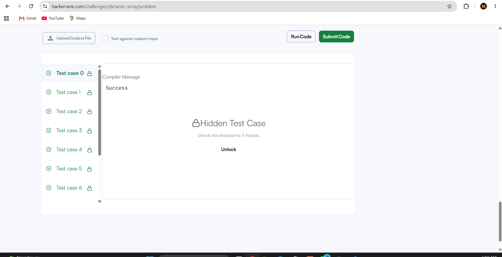
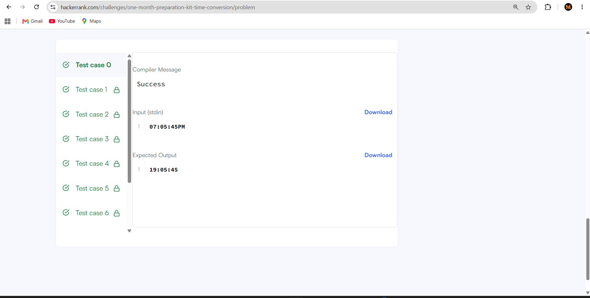
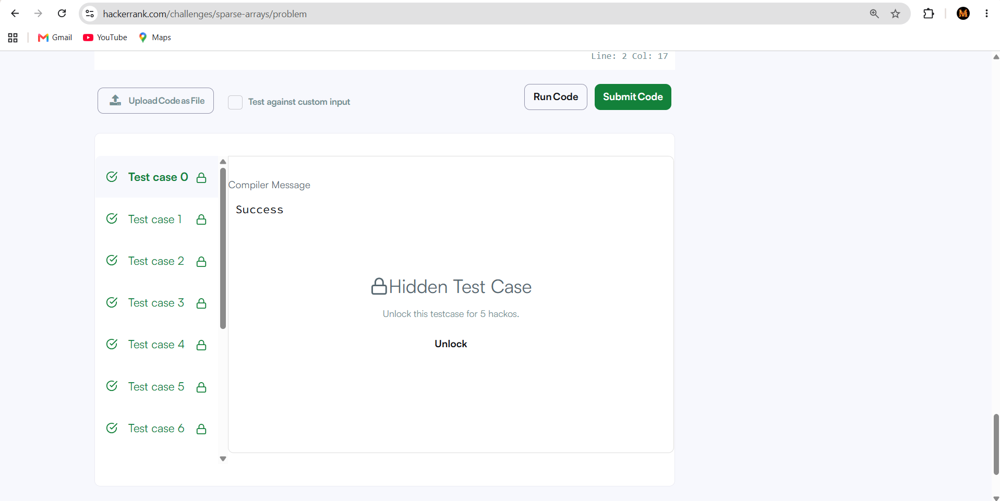

# HackerRank 3rd Semester Portfolio

## HackerRank Profile

[My HackerRank Profile](https://www.hackerrank.com/profile/mnmahe999)

## Problems Solved

| No. | Problem | Time Complexity | Space Complexity |
|---|---|---|---|
| 1 | Diagonal Difference | O(N) | O(1) |
| 2 | Dynamic Array | O(N + Q) | O(N) |
| 3 | Time Conversion | O(1) | O(1) |
| 4 | Compare the Triplets | O(1) | O(1) |
| 5 | Sparse Arrays | O(N + Q) average | O(N) |

## HackerRank Submissions

All 5 mandatory HackerRank problems were successfully submitted and accepted.

## Skills Demonstrated

- Array manipulation
- Strings
- Dynamic arrays
- Hashing and frequency mapping
- Algorithmic problem solving
- Time and space complexity analysis

## Problems Included & Accepted Submissions

### 1. Diagonal Difference

### 2. Dynamic Array

### 3. Time Conversion

### 4. Compare the Triplets

### 5. Sparse Arrays

## HackerRank Badges

<!-- Place your badge image inside the ScreenShots folder named 'hackerrank_badge.png' -->

